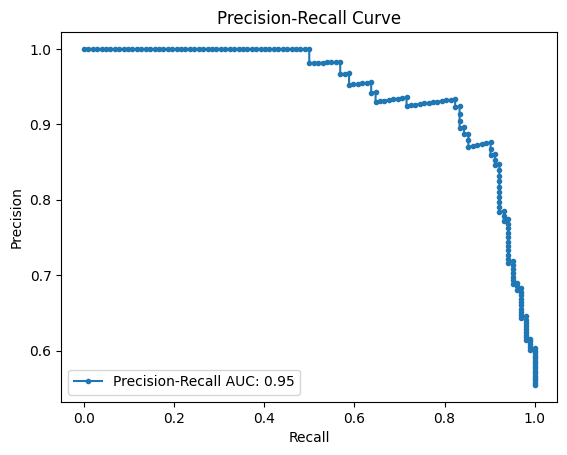
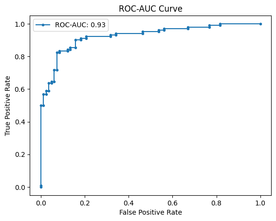

# Health failure prediction using Machine Learning

Welcome to the Health Failure Prediction project! This project leverages machine learning to predict heart failure based on various health metrics.

## Overview

This repository contains the code and resources for training and deploying a machine learning model to predict heart failure. The project includes both a frontend application built with React and a backend API built with Python (Flask).

## Features

- **Machine Learning Model**: SVM with RBF kernel, optimized using grid search cross-validation.
- **Frontend**: React application for user interaction and visualization.
- **Backend**: Flask API for serving the machine learning predictions.
- **Dockerized Deployment**: Easily deploy the application using Docker.

## Machine Learning framework

### Model selection

After conducting the EDA and an exhaustive grid search cross-validation among three models, we selected an SVM model with C=1, gamma=0.1, and an RBF kernel for deployment. This model uses One-Hot Encoding for categorical features and excludes the RestingBP feature (more info at EDA).

### Model Evaluation Results

- **Accuracy:** 0.875
- **F1 Score:** 0.8889
- **Precision:** 0.8762
- **Recall:** 0.9020
- **ROC-AUC:** 0.9255

| Class           | Precision | Recall | F1-Score |
|-----------------|-----------|--------|----------|
| No HeartDisease | 0.87      | 0.84   | 0.86     |
| HeartDisease    | 0.88      | 0.90   | 0.89     |
| **Accuracy**    |           |        | 0.88     |
| **Macro Avg**   | 0.87      | 0.87   | 0.87     |
| **Weighted Avg**| 0.87      | 0.88   | 0.87     |





## Installation Instructions

### Prerequisites

Ensure you have Docker and Docker Compose installed on your machine.

### Step 1: Clone the Repository

Clone the repository to your local machine:
```sh
git clone https://github.com/gbatsis/heart-failure-predictor.git
cd health-failure-prediction
```

### Step 2: Ensure the directory structure looks like this:

health-failure-prediction/

├── backend/

│   ├── Dockerfile

│   ├── requirements.txt

│   └── ... (other backend files)

├── frontend/

│   ├── Dockerfile

│   ├── package.json

│   ├── package-lock.json

│   └── ... (other frontend files)

├── docker-compose.yml

└── ... (other project files)

### Step 3: Docker Compose Configuration
Create or verify the docker-compose.yml file in the root of your project:

```yaml
version: '3.8'
services:
  frontend:
    build:
      context: ./frontend
      dockerfile: Dockerfile
    volumes:
      - ./frontend:/app
      - /app/node_modules
    ports:
      - "3000:3000"
    environment:
      - CHOKIDAR_USEPOLLING=true
  backend:
    build:
      context: ./backend
      dockerfile: Dockerfile
    volumes:
      - ./backend:/app
    ports:
      - "5050:5050"
```

### Step 4: Build and Run the Docker Containers
Run the following command to build and start the Docker containers:

```ssh
docker-compose up --build
```

### Step 5: Access the Application
Once the containers are running, you can access the application:

Frontend: Open your browser and navigate to http://localhost:3000

Backend: The backend server will be running at http://localhost:5050
